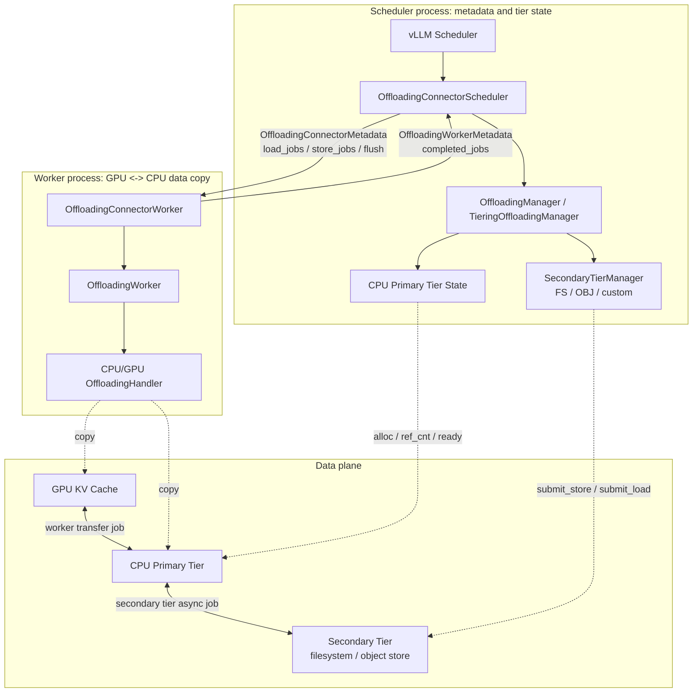
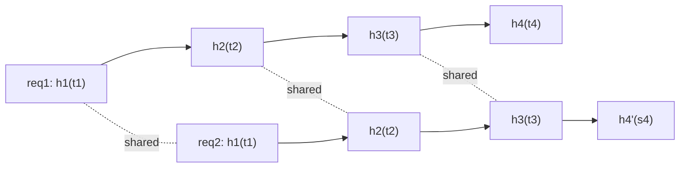
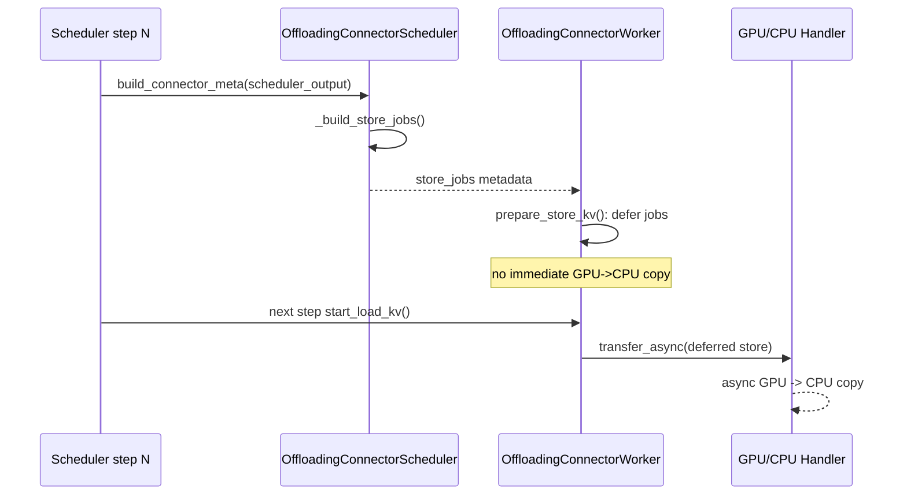
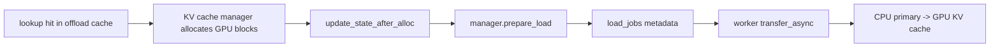
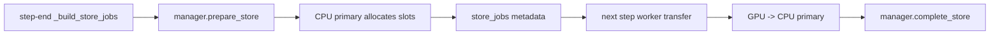
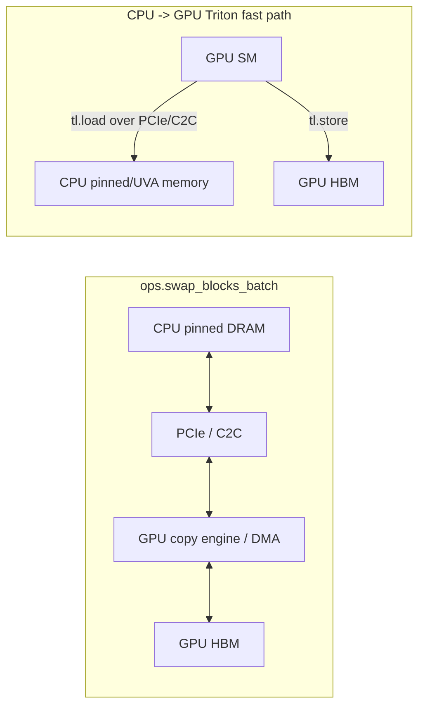
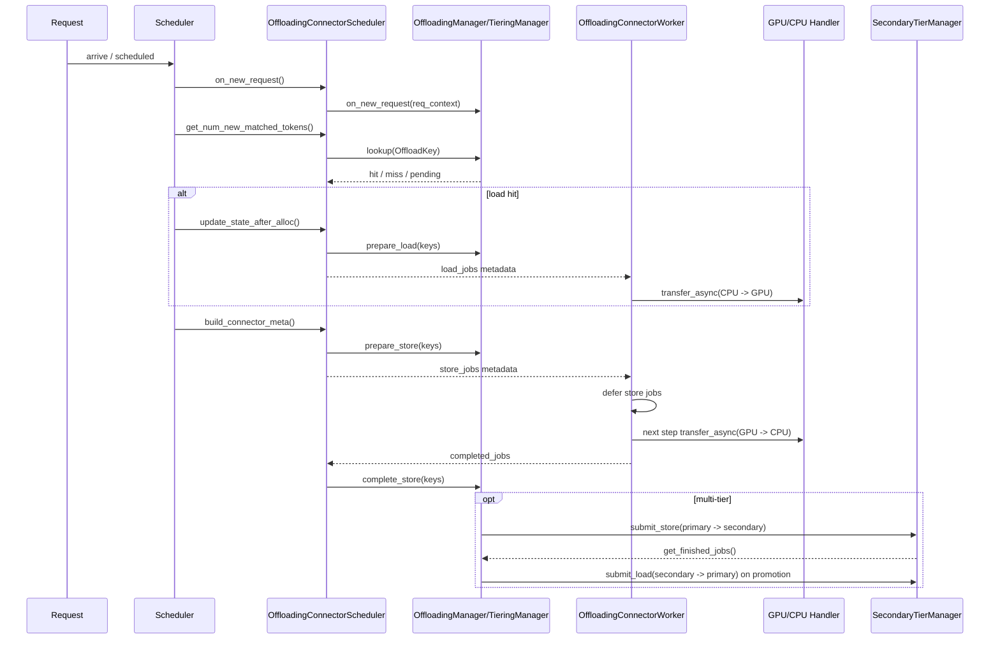

# vLLM KV Cache Offloading 源码梳理

KV offloading 关注的是 completed KV blocks 的生命周期管理。一个请求执行过程中会在 GPU HBM 中生成大量 KV blocks。当其中一些 blocks 已经完成写入并具有复用价值时，系统可以将其移到 CPU 或更低层级存储中保存。后续请求命中相同 prefix 时，再将对应 KV blocks promotion/load 回 GPU，用数据传输替代重复 prefill 计算。从系统效果上看，offloading 扩展的是 prefix cache 的有效容量。

为了实现 KV offloading 和 prefix hit 后的 KV 复用，vLLM 在 KV connector 路径中抽象了 offload/load、内容寻址、多层存储 tier、异步 GPU/CPU transfer，以及 ready state 和 ref-count 等状态管理。原生 `OffloadingConnector` 提供了一套基于 CPU primary tier 和可选 secondary tier 的实现，使 completed KV blocks 可以在 GPU 外继续被管理和复用。

原生 offloading 首先服务于单实例内的 prefix reuse。CPU-only offloading 会把 completed KV blocks 保存到当前 vLLM instance 管理的 CPU tier 中，因此后续复用也主要发生在同一实例内。若 secondary tier 使用 shared filesystem，多个实例可以在相同 `root_dir` 和一致 hash 配置下发现并读取已保存的 KV blocks，从而支持一定程度的跨实例复用。

MooncakeStore 和 LMCache 可以理解为更外部化的 KV cache layer。它们通过 connector 接入 vLLM，将 KV blocks 放到跨实例可见的 distributed store 或 memory pool 中，进一步支持多实例之间的 KV 发现、传输和生命周期管理。


### Prefill/Decode KV Offload 需求

一个长 prompt 经过 prefill 后，会一次性生成大量 KV blocks。Prefill KV offloading 的目标主要是用后续 load 替代重复 prefill，因此更接近 prefix cache extension。它的瓶颈主要有四类。

1. **Store bandwidth**：Prefill 后的 KV blocks 需要从 GPU 拷到 CPU DRAM 或 secondary tier。Store path 虽然可以异步后台化，但仍会占用 copy engine、PCIe/C2C、host memory bandwidth 等通信资源，并可能干扰 decode。

2. **Load latency**：Cache hit 只有在 load path 明显快于 recompute 时才有收益。这里的开销不只是数据搬运，还包括 lookup、metadata 处理、load 任务构造、DMA launch 和同步等待。

3. **Cache admission**：并不是所有 prefix 都值得 offload。一次性 prompt 没有复用收益，只会消耗带宽和 cache 空间。更适合 offload 的是长 prompt、公共 system prompt、多轮会话历史和高复用模板。

4. **Layout / block 粒度**：如果 KV 的物理布局不连续，或者一个逻辑 block 对应多个分散片段，D2H/H2D copy 会退化成大量小拷贝，实际吞吐会明显下降。

Decode KV offloading 面对的是另一类瓶颈。Decode 阶段关注 TPOT、P95/P99 token latency 和 jitter。相比 prefill 的大块批量 store/load，decode 如果按 block 粒度 offload，单次搬运的数据量通常更小，因此它不一定首先受限于总带宽，而是更容易受限于固定开销和同步抖动。

具体来说，decode offloading 的 overhead 主要来自四部分。

1. **Metadata overhead**：包括 block lookup、block table 查询、offload tier 状态检查、load/store spec 构造和 eviction 状态更新。Decode 单次搬运粒度小，这些固定开销更难摊薄。

2. **DMA launch overhead**：小 block 高频搬运时，每次 copy 的 stream enqueue、地址准备、DMA launch 和事件依赖管理都会变得明显。此时瓶颈可能不是带宽打满，而是搬运粒度过细。

3. **Synchronization overhead**：这是 decode 最敏感的部分。Active KV 必须在 attention 使用前 ready，因此异步 load 最终可能变成 event wait 或 stream sync。Prefill load 主要影响 TTFT，而 decode load 会直接影响 TPOT。

4. **Copy-resource contention**：Decode load/store 会和 prefill store、GPU-CPU 数据交换、通信操作以及其他 background transfer 竞争 copy engine、PCIe/C2C 和 host memory bandwidth。即使单次搬运量不大，只要排队发生在 token step 前，就会制造 P95/P99 latency spike。

因此，prefill offloading 更偏 **bandwidth-amortized optimization**：用带宽换重复 prefill 计算，关键是复用收益能否摊薄 store/load 成本。Decode offloading 更偏 **overhead-sensitive state management**：关键不是单次搬运量，而是避免 active KV 的跨 tier transfer 进入 token-level critical path。实际系统中，active decode KV 应尽量驻留 GPU，offloading 更适合 request pause、preemption、turn boundary 或容量压力下的 inactive KV。


## 2. 性能估算：50k prompt 的 KV 传输量

Offloading 传输的是 KV cache，不是模型权重。因此“模型 int8 量化”不等价于“KV cache int8 传输”。如果 `--kv-cache-dtype=auto`，KV cache 可能仍是 bf16/fp16；只有显式使用 int8/fp8/fp8-ds-mla 等 KV cache dtype 时，offload 传输量才会按对应 KV layout 下降。

普通 GQA/MHA attention 的 KV 体积可以按下式估算。设输入 token 数为 `T`，层数为 `L`，每层 KV head 数为 `H_kv`，head dim 为 `D`，每个元素字节数为 `s`：

```text
B_std = T * L * 2 * H_kv * D * s
```

其中 `2` 对应 K 和 V。vLLM 的 `AttentionSpec.real_page_size_bytes` 也是按这个结构计算。

GLM-5.1 这类 DSA/MLA 路线更接近 latent KV cache。vLLM 的 MLA cache 存储的不是展开后的 full K/V，而是压缩表示：

```text
B_mla = T * L * (kv_lora_rank + qk_rope_head_dim) * s
```

如果按常见 MLA/DSA 形态估算，取：

```text
kv_lora_rank = 512
qk_rope_head_dim = 64
head_size = 576
T = 50,000
```

则每层 KV 体积约为：

| KV cache layout | 每层 50k token KV |
| --- | ---: |
| bf16/fp16 MLA KV | `50,000 * 576 * 2 = 57.6 MB` |
| int8/fp8 MLA KV | `50,000 * 576 * 1 = 28.8 MB` |
| `fp8_ds_mla` 特殊布局 | `50,000 * 656 = 32.8 MB` |

总量还需要乘以 layer 数。以 80 层为例：

| KV cache layout | 50k prompt 总 KV |
| --- | ---: |
| bf16/fp16 MLA KV | 4.61 GB |
| int8/fp8 MLA KV | 2.30 GB |
| `fp8_ds_mla` | 2.62 GB |

如果实际 GLM-5.1 配置的层数或 KV layout 不同，应直接替换公式里的 `L`、`kv_lora_rank`、`qk_rope_head_dim` 和 `s`。这个估算是每个 worker/rank 视角的传输量；多 GPU 部署时，系统还要承受聚合 PCIe/C2C、host memory 和 NUMA 压力。

### DRAM offloading 时间下界

DRAM-only offloading 的 GPU/CPU 传输时间下界可以按带宽估算：

```text
transfer_time = bytes / effective_bandwidth
```

常见有效带宽可粗略取：

| 链路 | 经验有效带宽 |
| --- | ---: |
| PCIe Gen4 x16 | 24-28 GB/s |
| PCIe Gen5 x16 | 45-55 GB/s |
| NVLink-C2C / coherent CPU-GPU interconnect | 100+ GB/s，取决于平台 |

仍以 80 层、50k prompt 为例：

| KV cache layout | 25 GB/s | 50 GB/s | 100 GB/s |
| --- | ---: | ---: | ---: |
| bf16/fp16, 4.61 GB | 184 ms | 92 ms | 46 ms |
| int8/fp8, 2.30 GB | 92 ms | 46 ms | 23 ms |
| `fp8_ds_mla`, 2.62 GB | 105 ms | 52 ms | 26 ms |

这些数值只是链路带宽下界。真实时间还会受 pinned memory、NUMA、PCIe switch、descriptor 数量、其他 GPU 并发 copy、CPU memory bandwidth 以及 copy engine/SM 竞争影响。

### 与 vLLM step 的重叠关系

对于 store path，当前实现不要求在产生 store job 的同一个 scheduler step 内完成：

```text
step N:
  prefill/decode compute
  build_connector_meta()
  _build_store_jobs()
  worker.prepare_store_kv(): 只缓存 job，不立即 copy

step N+1 开始:
  worker.start_kv_transfers()
  transfer_async()
  独立 stream 上执行 GPU -> CPU copy
```

GPU -> CPU store 的 transfer stream 会先 `wait_stream(current_stream())`，确保模型计算已经写完 GPU KV，再从 HBM 读出。多个 transfer job 在 handler 内部按提交顺序串行化：新的 transfer 会等待上一个 transfer 的 end event。

因此，store 一般不是 Python 同步阻塞，也不要求在当前 step 内完成。它可以跨多个 engine step 在后台继续传输。后台传输完成后，worker 通过 `OffloadingWorkerMetadata.completed_jobs` 上报；scheduler 在 `update_connector_output()` 中调用 `complete_store()`，CPU tier 中对应 block 才从 not-ready 变成 ready。

传输到一半时，语义是 job 级 not-ready：

```text
CPU slot 已分配
OffloadKey 已插入 manager
BlockStatus.ref_cnt = -1
lookup(key) -> None
不能被作为 cache hit 读取
```

如果后续 request 查到这个 key，scheduler 会看到 pending，而不是读取半成品。如果源 GPU block 即将被复用、request 被 preempt、cache reset，或者所有请求都已结束而没有后续 step 触发 completion，scheduler 会把相关 job 放入 `jobs_to_flush`，worker 调用 `wait()` 等传输完成，避免从已被覆盖的 GPU block 继续读。

Load path 的语义更严格。Load 是当前 request 的关键路径：scheduler 必须先分配 GPU KV blocks，再提交 CPU -> GPU load；load 完成前 request 不能把这段 prefix 当作已计算状态继续执行。因此，长 prefix load 的收益来自用几十毫秒级的数据传输替代更昂贵的 prefill recompute；短 prefix 则可能被 transfer overhead 吞掉收益。

## 3. 先校准几个容易误解的点

这条 offloading 路径更像“外部 prefix/KV cache 扩展”，而不是传统意义上的 HBM pressure driven paging。

- Store 触发由 scheduler step 驱动，不是等 HBM 放不下时临时换出。
- Store 是拷贝 KV block 到 offload tier，不等价于立刻释放 GPU KV block；GPU block 的分配、复用、抢占仍由 vLLM scheduler/KV cache manager 管理。
- Worker 侧主要负责 GPU KV cache 与 CPU primary tier 之间的 tensor copy。
- CPU primary tier 与 secondary tier 之间的 transfer 由 scheduler-side tier manager 提交异步任务，不是 `OffloadingWorker` 的 GPU copy handler 在执行。
- Multi-tier 中，新写入 CPU primary 的 blocks 默认 cascade 到所有配置的 secondary tiers；是否已存在、容量淘汰等由 secondary tier 自己处理。

整体路径如下：



源码依据：

```python
# vllm/distributed/kv_transfer/kv_connector/v1/offloading/worker.py
def _register_handlers(self, kv_caches: CanonicalKVCaches):
    for src_cls, dst_cls, handler in self.spec.get_handlers(kv_caches):
        self.worker.register_handler(src_cls, dst_cls, handler)
```

```python
# vllm/v1/kv_offload/tiering/base.py
class SecondaryTierManager(ABC):
    """
    Secondary tiers cannot directly access GPU memory. All data transfers
    must go through the CPU (primary) tier:
      - Store: GPU -> CPU (primary) -> secondary  (cascade)
      - Load:  secondary -> CPU (primary) -> GPU  (promotion)

    IMPORTANT: All methods run in the Scheduler process and must be
    lightweight and non-blocking.
    """
```

## 4. 存储单位与寻址

Offloading cache 按 KV block 做内容寻址。最终 key 由 block hash 和 KV cache group id 组成：

```text
OffloadKey = block_hash + kv_group_idx
```

实现位置：`vllm/v1/kv_offload/base.py`

```python
OffloadKey = NewType("OffloadKey", bytes)

def make_offload_key(block_hash: bytes, group_idx: int) -> OffloadKey:
    """Pack a block hash and group index into an `OffloadKey`."""
    return OffloadKey(block_hash + group_idx.to_bytes(4, "big", signed=False))
```

`block_hash` 是链式 hash。当前 block 的 key 不只取决于当前 block token ids，也取决于 parent block hash。因此只有完整 prefix 一致的 blocks 才能共享 offload entry。

实现位置：`vllm/v1/core/kv_cache_utils.py`

```python
def hash_block_tokens(
    hash_function: Callable[[Any], bytes],
    parent_block_hash: BlockHash | None,
    curr_block_token_ids: Sequence[int],
    extra_keys: tuple[Any, ...] | None = None,
) -> BlockHash:
    if not parent_block_hash:
        parent_block_hash = NONE_HASH

    curr_block_token_ids_tuple = tuple(curr_block_token_ids)
    return BlockHash(
        hash_function((parent_block_hash, curr_block_token_ids_tuple, extra_keys))
    )
```

示例：



`req1: t1 t2 t3 t4...` 与 `req2: t1 t2 t3 s4...` 共享前三个 block；从第 4 个 block 开始 hash 链分叉。后续 request 不会覆盖已有 request 的 KV。容量不足时发生的是 cache eviction。

KV cache group id 用作命名空间。Hybrid model 可能同时有 full attention、sliding-window、Mamba 等不同 KV cache group；相同 prefix 在不同 group 下对应不同 KV 数据，因此 offload key 必须包含 `group_idx`。

Scheduler 侧将 `request.block_hashes` 转为 group-specific `OffloadKey`：

实现位置：`vllm/distributed/kv_transfer/kv_connector/v1/offloading/scheduler.py`

```python
def update_offload_keys(self) -> None:
    ...
    group_state.offload_keys.append(
        make_offload_key(req_block_hash, group_config.group_idx)
    )
```

## 5. Request 生命周期

Request 进入 scheduler 后，offloading connector 会保存 request-level 状态：

实现位置：`vllm/distributed/kv_transfer/kv_connector/v1/offloading/scheduler.py`

```python
def on_new_request(self, request: Request) -> None:
    req_context = _create_req_context(request)
    offloading_context = self.manager.on_new_request(req_context)
    req_status = RequestOffloadState(
        config=self.config,
        req=request,
        req_context=req_context,
        offloading_context=offloading_context,
    )
    self._req_status[request.request_id] = req_status
```

`ReqContext` 只携带 request id 和 request-level `kv_transfer_params`：

```python
def _create_req_context(req: Request) -> ReqContext:
    return ReqContext(
        req_id=req.request_id,
        kv_transfer_params=req.kv_transfer_params,
    )
```

`offloading_context` 是 manager 返回的 request-level offloading 状态，目前主要是 `policy`。

查询 offload hit 时，scheduler 先更新 offload keys，再逐 block lookup：

```python
def get_num_new_matched_tokens(
    self, request: Request, num_computed_tokens: int
) -> tuple[int | None, bool]:
    req_status = self._req_status[request.request_id]
    req_status.update_offload_keys()
    req_status.num_locally_computed_tokens = num_computed_tokens

    if request.skip_reading_prefix_cache:
        num_hit_tokens = 0
    else:
        num_hit_tokens = self._lookup(req_status)
```

lookup 的底层单位是 `OffloadKey`：

```python
for key in keys:
    result = self.manager.lookup(key, req_context)
    if result is False:
        break
    if result is None:
        return None
    num_hit_blocks += 1
```

返回值语义：

- `True`：block 已存在且 ready。
- `False`：block 不存在。
- `None`：block 存在但暂不可读，例如 primary 正在写入、secondary promotion 中或 secondary lookup 尚未完成。

Full attention 通常查最长 prefix；sliding-window/Mamba 按窗口或 suffix 逻辑查询。

## 6. Store 触发模型

Store 不是 request finish 时统一发生，也不是 HBM 不够时临时触发。它发生在每个 scheduler step 末尾，由 `build_connector_meta()` 构造 store metadata。



实现位置：`vllm/distributed/kv_transfer/kv_connector/v1/offloading/scheduler.py`

```python
meta = OffloadingConnectorMetadata(
    load_jobs=self._current_batch_load_jobs,
    store_jobs=self._build_store_jobs(scheduler_output),
    jobs_to_flush=self._current_batch_jobs_to_flush,
)
```

`_build_store_jobs()` 只扫描本 step 被调度的 requests：

```python
for req_id in scheduler_output.num_scheduled_tokens:
    num_scheduled_tokens = scheduler_output.num_scheduled_tokens[req_id]
    num_tokens_after_batch = req.num_computed_tokens + num_scheduled_tokens
    num_offloadable_tokens = min(num_tokens_after_batch, req.num_tokens)
```

只有完整 offloaded block 才能进入 candidate 范围：

```python
num_blocks = num_offloadable_tokens // group_config.offloaded_block_size
start_block_idx = group_state.next_stored_block_idx
if num_blocks <= start_block_idx:
    continue
```

主要过滤条件：

- 不完整 block 等后续 step 补齐。
- `offload_prompt_only` 会把 store 范围限制到 prompt。
- `BLOCK_LEVEL` 跳过 prefix-hit blocks。
- sliding-window/Mamba/HMA 可能跳过 null block 或 load path 不可达 blocks。
- manager 会过滤已经存在的 keys。

Worker 侧会延迟 store jobs：

实现位置：`vllm/distributed/kv_transfer/kv_connector/v1/offloading/worker.py`

```python
def prepare_store_kv(self, metadata: OffloadingConnectorMetadata):
    for job_id, entry in metadata.store_jobs.items():
        self._unsubmitted_store_jobs.append((job_id, entry.transfer_spec))
```

下一 step 开始再提交：

```python
def start_kv_transfers(self, metadata: OffloadingConnectorMetadata):
    for job_id, transfer_spec in self._unsubmitted_store_jobs:
        success = self.worker.transfer_async(job_id, transfer_spec)
        assert success
    self._unsubmitted_store_jobs.clear()
```

Request finish 不是常规补写点。源码中仍保留 TODO：

```python
# TODO(orozery): possibly kickoff offload for last block
# which may have been deferred due to async scheduling
```

finish 阶段主要处理 pending store 的 block 保护，避免 request 结束后 GPU block 被复用而 store 尚未完成：

```python
# Pending stores will outlive the request's block ownership.
# Register them so future block reuse triggers a flush.
for job_id in req_status.transfer_jobs:
    job_status = self._jobs[job_id]
    for bid in job_status.non_sliding_window_block_ids or ():
        self._block_id_to_pending_jobs.setdefault(bid, set()).add(job_id)
```

## 7. Offloading Policy

定义位置：`vllm/v1/kv_offload/base.py`

```python
class OffloadPolicy(Enum):
    BLOCK_LEVEL = "block_level"
    REQUEST_LEVEL = "request_level"
```

### `BLOCK_LEVEL`

默认策略。只 store 当前 request 新计算出的 blocks；prefix-hit blocks 不重复 store。

实现位置：`vllm/distributed/kv_transfer/kv_connector/v1/offloading/scheduler.py`

```python
if req_status.offloading_context.policy == OffloadPolicy.BLOCK_LEVEL:
    group_state.next_stored_block_idx = num_blocks
```

后续 `_build_store_jobs()` 从 `next_stored_block_idx` 开始选择 candidate keys：

```python
start_block_idx = group_state.next_stored_block_idx
offload_keys = group_state.offload_keys[start_block_idx:num_blocks]
```

### `REQUEST_LEVEL`

用于需要完整 request KV 上下文的 secondary tier。任一 secondary tier 返回 `REQUEST_LEVEL` 时，该 request 的 scheduler-side policy 变为 `REQUEST_LEVEL`。

实现位置：`vllm/v1/kv_offload/tiering/manager.py`

```python
for tier in self.secondary_tiers:
    tier_ctx = tier.on_new_request(req_context)
    if tier_ctx.policy == OffloadPolicy.REQUEST_LEVEL:
        self._request_level_tiers[req_context.req_id].add(tier)
```

如果 prefix-hit blocks 已经在 CPU primary 中，multi-tier manager 不重复写 primary，而是只向 request-level secondary tiers cascade：

```python
keys_already_in_primary = tuple(
    k for k in keys if k not in keys_to_store_set
)
if keys_already_in_primary:
    self._cascade_existing_blocks_to_request_level_tiers(
        keys_already_in_primary, req_context, request_level_tiers
    )
```

## 8. Load Path

Offload hit 需要先分配 GPU KV blocks，然后构造 CPU primary -> GPU 的 load job。



实现位置：`vllm/distributed/kv_transfer/kv_connector/v1/offloading/scheduler.py`

```python
src_spec = self.manager.prepare_load(keys_to_load, req_status.req_context)
dst_spec = GPULoadStoreSpec(
    dst_block_ids, group_sizes=group_sizes, block_indices=block_indices
)
```

CPU tier 的 `prepare_load()` 会增加 `ref_cnt`，防止 block 在传输期间被淘汰：

实现位置：`vllm/v1/kv_offload/cpu/manager.py`

```python
block = self._policy.get(key)
assert block is not None, f"Block {key!r} not found in cache"
assert block.is_ready, f"Block {key!r} is not ready for reading"
block.ref_cnt += 1
```

完成后，scheduler 在 `update_connector_output()` 中调用 `complete_load()`，释放这层保护：

```python
if job_status.is_store:
    self.manager.complete_store(job_status.keys, req_status.req_context)
else:
    self.manager.complete_load(job_status.keys, req_status.req_context)
```

## 9. Store Path

Store path 的作用是将满足条件的新 KV blocks 从 GPU 拷贝到 CPU primary。对 DRAM-only offloading，到 CPU primary 即结束；对 multi-tier，primary store 完成后还会 cascade 到 secondary tiers。



实现位置：`vllm/distributed/kv_transfer/kv_connector/v1/offloading/scheduler.py`

```python
store_output = self.manager.prepare_store(
    new_offload_keys, req_status.req_context
)
```

CPU tier 会过滤已存在 keys：

实现位置：`vllm/v1/kv_offload/cpu/manager.py`

```python
keys_to_store = [k for k in keys if self._policy.get(k) is None]
```

DRAM-only `store_threshold` 可按 lookup 次数过滤低复用 blocks；`TieringOffloadingSpec` 不支持该参数：

```python
if self.counts is not None:
    keys = [k for k in keys if self.counts.get(k, 0) >= self.store_threshold]
```

新 key 分配 CPU block 并插入 cache policy：

```python
blocks = self._allocate_blocks(keys_to_store)
for key, block in zip(keys_to_store, blocks):
    self._policy.insert(key, block)
```

空间不足时由 LRU/ARC policy 决定 eviction。`protected = set(keys)` 避免本次 store 相关 keys 被同一轮淘汰。

## 10. Worker 侧数据拷贝

Scheduler 只生成 transfer metadata。Worker 根据 `(src.medium(), dst.medium())` 分发到对应 handler：

实现位置：`vllm/v1/kv_offload/worker/worker.py`

```python
src, dst = spec
transfer_type = (src.medium(), dst.medium())
handler = self.transfer_type_to_handler.get(transfer_type)
success = handler.transfer_async(job_id, spec)
```

GPU/CPU handler 在独立 stream 上执行 block copy：

实现位置：`vllm/v1/kv_offload/cpu/gpu_worker.py`

```python
with current_platform.stream(stream):
    start_event.record(stream)
    if num_copy_ops > 0:
        self._swap_blocks_batch(
            src,
            dst,
            sizes,
            is_src_access_order_any=is_src_access_order_any,
        )
    end_event.record(stream)
```

Copy function 选择逻辑：

```python
if gpu_to_cpu:
    return ops.swap_blocks_batch
if not HAS_TRITON or current_platform.is_xpu():
    return ops.swap_blocks_batch
if not page_sizes or max(page_sizes) >= THRESHOLD_BYTES or any(s % 8 for s in page_sizes):
    return ops.swap_blocks_batch
return functools.partial(swap_blocks_batch, bytes_per_chunk=chunk)
```

含义：

- GPU -> CPU store：走 `ops.swap_blocks_batch`，即 C++ batched memcpy / DMA path。
- CPU -> GPU load：满足 Triton 可用、非 XPU、小 page、8-byte 对齐且 descriptor 数量足够时，走 Triton kernel；否则回退到 `ops.swap_blocks_batch`。
- Triton path 使用 GPU SM 从 CPU pinned/UVA memory load，再 store 到 HBM；不是 copy engine DMA。

## 11. 传输机制与通信影响

DRAM/FS offloading 的 GPU/CPU 传输不使用 NCCL、NIXL 或 RDMA。它是本节点内 GPU HBM 与 CPU memory 之间的 copy。



硬件链路取决于平台拓扑：

- 普通 x86 + PCIe GPU：CPU DRAM 与 GPU HBM 之间通常走 PCIe。
- Grace Hopper 等平台：CPU/GPU 之间可能走 NVLink-C2C 或 coherent interconnect。
- NCCL 不是这条 CPU/GPU copy 的执行机制。

是否影响 NCCL 取决于 NCCL 实际选路：

- NCCL 也走 PCIe 或 GPUDirect RDMA/NIC 时，offload DMA 可能竞争 PCIe switch、root complex、NIC 或 GPU copy engine。
- NCCL 主要走 NVLink/NVSwitch，而 offload 走 PCIe/C2C 时，链路层直接冲突较小，但仍可能争用 GPU copy engine、L2/memory subsystem、host memory bandwidth 或 NUMA 链路。
- CPU -> GPU Triton fast path 会占用 SM，因此可能与计算 kernel 或 NCCL kernel 产生执行资源竞争。

Filesystem secondary 不直接访问 GPU。它读写 CPU primary memory view：

```text
CPU DRAM -> filesystem / block device IO -> local NVMe or shared filesystem
```

实现位置：

- `vllm/v1/kv_offload/tiering/fs/manager.py`
- `vllm/v1/kv_offload/tiering/fs/io.py`

```python
fd = os.open(tmp_path, os.O_CREAT | os.O_EXCL | os.O_WRONLY | os.O_TRUNC | O_DIRECT)
written = os.write(fd, view_slice)
...
fd = os.open(source_path, os.O_RDONLY | O_DIRECT)
bytes_read = os.readv(fd, [view_slice])
```

Object-store secondary 是例外：`vllm/v1/kv_offload/tiering/obj/manager.py` 使用 NIXL OBJ backend 在 CPU DRAM 与对象存储之间传输。因此“offloading 不用 NIXL”只适用于 DRAM-only 和 filesystem secondary。

## 12. Multi-tier Offloading

Multi-tier 数据路径：

```text
GPU KV cache <-> CPU primary tier <-> secondary tier
```

### 初始化

实现位置：`vllm/v1/kv_offload/tiering/spec.py`

```python
primary_tier = CPUPrimaryTierOffloadingManager(...)
tier = SecondaryTierFactory.create_secondary_tier(...)
tiering_manager = TieringOffloadingManager(...)
```

### Cascade: primary -> secondary

通过 scheduler/primary 过滤并成功写入 CPU primary 的新 blocks，会默认提交给所有 configured secondary tiers。

实现位置：`vllm/v1/kv_offload/tiering/manager.py`

```python
self.primary_tier.complete_store(keys, req_context, success)
if not success:
    return

for tier in self.secondary_tiers:
    primary_blocks_spec = self.primary_tier.prepare_read(keys, req_context)
    ...
    tier.submit_store(job_metadata)
```

这不是基于 HBM pressure 的冷热选择。更早的 scheduler 过滤决定哪些 blocks 进入 offload system；secondary tier 自己可以在 `submit_store()` 中去重、淘汰或分配后端空间。

### Promotion: secondary -> primary

CPU primary miss 且 secondary hit 时，manager 启动 promotion。Promotion 先在 CPU primary 分配目标 slot，再提交 secondary -> primary load。

```python
primary_hit = self.primary_tier.lookup(key, req_context)
if primary_hit is True:
    return True

for tier in self.secondary_tiers:
    result = tier.lookup(key, req_context)
    if result is True:
        if not self._initiate_promotion(tier, key, req_context):
            return False
        return None
```

Promotion 请求按 `(tier, request)` 聚合，并在 `on_schedule_end()` flush：

```python
tier_pending = self._pending_load_submissions.setdefault(tier, {})
...
tier.submit_load(job_metadata)
```

不同 request 分别生成 promotion job。

### Filesystem sharing

Filesystem tier 通过 block hash 映射文件名。跨进程共享 filesystem cache 时需要固定 `PYTHONHASHSEED`；否则 `NONE_HASH` 随进程随机化，相同 token 内容可能映射到不同文件名。

## 13. Completion 与状态回收

Worker 完成 GPU/CPU transfer 后，将 job id 写入 `OffloadingWorkerMetadata`；scheduler 在 `update_connector_output()` 中消费完成事件。

实现位置：`vllm/distributed/kv_transfer/kv_connector/v1/offloading/scheduler.py`

```python
if job_status.is_store:
    self.manager.complete_store(job_status.keys, req_status.req_context)
else:
    self.manager.complete_load(job_status.keys, req_status.req_context)
```

CPU tier 中：

- `complete_load()` 降低 `ref_cnt`，允许后续 eviction。
- `complete_store()` 将 block 标记为 ready。

Secondary tier completion 由 `TieringOffloadingManager._maybe_process_finished_jobs()` 轮询 secondary tier 的 `get_finished_jobs()`，然后更新 primary 的 read/write 状态。

```python
for tier in self.secondary_tiers:
    for completed_job in tier.get_finished_jobs():
        job_metadata = self._transfer_jobs.pop(job_id, None)
        ...
```

## 14. End-to-End Flow



## 15. 阅读入口

1. `vllm/v1/kv_offload/base.py`
   `OffloadKey`、`ReqContext`、`OffloadPolicy`、`OffloadingManager`。

2. `vllm/v1/core/kv_cache_utils.py`
   `hash_block_tokens()`、`get_request_block_hasher()`。

3. `vllm/distributed/kv_transfer/kv_connector/v1/offloading/scheduler.py`
   `on_new_request()`、`get_num_new_matched_tokens()`、`update_state_after_alloc()`、`_build_store_jobs()`、`update_connector_output()`。

4. `vllm/distributed/kv_transfer/kv_connector/v1/offloading/worker.py`
   load/store jobs 的 worker 侧提交。

5. `vllm/v1/kv_offload/worker/worker.py`
   transfer handler 分发。

6. `vllm/v1/kv_offload/cpu/manager.py`
   DRAM tier 索引、去重、eviction、ref count。

7. `vllm/v1/kv_offload/cpu/gpu_worker.py`
   GPU <-> CPU block copy。

8. `vllm/v1/kv_offload/tiering/manager.py`
   CPU primary + secondary tier promotion/cascade。

9. `vllm/v1/kv_offload/tiering/base.py`
   secondary tier 抽象接口与 scheduler-side 约束。

10. `vllm/v1/kv_offload/tiering/fs/manager.py`
    filesystem secondary tier。
